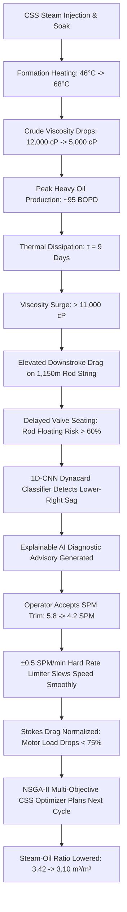

# BaghTwin — AI Digital Twin for Baghewala Heavy Oil Field

### Smart India Hackathon 2026 — Problem Statement 26120
**Ministry / Organization:** Oil India Limited (OIL)  
**Category:** Smart Automation / Upstream Petroleum Engineering  
**Asset:** Baghewala Field, Bikaner-Nagaur Basin, Rajasthan (17–19° API Extra-Heavy Crude)

---

## 1. Executive Summary

**BaghTwin** is an industrial-grade, well-to-surface AI Digital Twin prototype engineered for heavy oil thermal recovery operations. It closes the operational loop between subsurface reservoir thermodynamics and surface mechanical lift:

$$\text{Cyclic Steam Stimulation (CSS)} \iff \text{Sucker Rod Pump (SRP) Artificial Lift}$$

### The Core Engineering Challenge at Baghewala
At the Baghewala Field in Rajasthan, reservoirs contain extra-heavy crude (17–19° API) exhibiting cold viscosities exceeding **10,000–12,000 cP** at baseline reservoir temperature (~46°C). Cyclic Steam Stimulation (CSS) heats the formation near-wellbore to ~60–72°C, reducing crude viscosity to ~5,000 cP and permitting artificial lift.

However, as thermal recovery heat naturally dissipates over a 30–45 day production cycle:
1. **Cooling Accelerates:** Temperature decays exponentially ($T(t) = T_{\text{base}} + (T_{\text{peak}} - T_{\text{base}})e^{-t/\tau}$, $\tau \approx 9$ days).
2. **Viscosity Surges:** Walther equation physics causes crude viscosity to double from 5,000 cP to over 11,000 cP.
3. **Viscous Downstroke Drag:** Sucker rod strings (1,150 m depth) experience severe fluid drag during the downstroke.
4. **Rod Floating Hazard:** When downward gravitational rod velocity falls below plunger speed ($v_{\text{rod}} < v_{\text{plunger}}$), the rod string enters axial compression, causing helical buckling, tubing wear, and eventual parting (requiring costly rig workovers).
5. **Traditional Pumping Fails:** Fixed-speed pumping units or uncoordinated operations either pump too fast (causing parted rods) or cut off steam cycles prematurely (sacrificing deliverability).

---

## 2. The BaghTwin Causal Chain



---

## 3. Key Technical Innovations

### A. Central Physics Engine (`src/sim/physics.ts`)
- **Calibrated Walther Viscosity Equation:** Exactly calibrated to Baghewala crude targets:
  - $48^\circ\text{C} \implies 12,000\text{ cP}$
  - $62^\circ\text{C} \implies 5,000\text{ cP}$
- **Stokes Drag & Terminal Rod Velocity:** Models downstroke viscous retardation and compressive rod buckling hazard.
- **Gibbs 1D Damped Wave Equation Reconstruction:** Solves downhole pump dynamometer card profiles from surface polished rod load measurements.

### B. Mandatory Safety Envelope & Interlocks
- **Strict $\pm 0.5\text{ SPM/min}$ Rate Limiter:** Prevents sudden acceleration/deceleration shocks to the gearbox, walking beam, and sucker rod string.
- **Operating Modes:**
  - `ADVISORY`: AI recommends setpoints; human operator explicitly reviews and approves.
  - `SUPERVISED`: AI auto-trims SPM within the safe operating envelope.
  - `SIMULATION`: Offline scenario sandbox for petroleum engineers.

### C. Simulated AI Models (Clearly Labeled)
- **1D-CNN Dynacard Classifier — SIMULATED:** Identifies 7 dynacard conditions (Normal, Rod Floating, Fluid Pound, Gas Interference, Parted Rod, Heavy Fluid Drag, Unseated Pump) with 12.4 ms inference latency.
- **PINN Thermal Decline Forecast — SIMULATED:** Physics-Informed Neural Network predicting 30-day reservoir cooling curves and viscosity surges.
- **Isolation Forest — SIMULATED:** Real-time multivariate anomaly detection across motor load, pump fillage, and rod load.
- **NSGA-II Genetic Multi-Objective Optimizer — SIMULATED:** Evaluates Pareto-optimal steam volume (m³) vs. soak duration (days) to minimize Steam-Oil Ratio (SOR).

---

## 4. Application Architecture & Pages

| Route | Page | Purpose |
| :--- | :--- | :--- |
| **`/`** | **Command Center** | P0 Hero dashboard with 6 hero KPIs, Walther viscosity curves, PINN thermal forecasts, 6-stage twin pipeline, and explainable AI recommendations. |
| **`/digital-twin`** | **Subsurface Twin Schematic** | Animated well cross-section (walking beam, rod string at 1,150 m, traveling valves, and thermal chamber glow) with 4 overlays: Thermal, Pressure, Viscosity, and Flow. |
| **`/dynocard`** | **Dynacard Analysis** | Closed-loop Surface and Downhole Gibbs cards with morphing animations, 1D-CNN classifier confidence bars, and fault injection sandbox. |
| **`/srp-control`** | **SRP Closed-Loop Control** | Interactive SPM slider (1.5–8.5 SPM), VFD frequency, live $\pm 0.5\text{ SPM/min}$ slewing timer, safety envelope status, and full SCADA audit log. |
| **`/css-optimizer`** | **CSS Cycle Optimizer** | Cycle timeline (Injection $\to$ Soak $\to$ Production), multi-objective Pareto front chart (Steam vs. Net Oil vs. SOR), and steam economic cutoff models. |
| **`/predictions`** | **Predictions & Alerts** | Deduplicated alarm lifecycle management (Active, Acknowledged, Resolved) and forward-looking AI horizon forecasts. |
| **`/maintenance`** | **Predictive Maintenance** | Subassembly health indices (sucker rods, surface beam unit, downhole pump, VIT tubing), RUL days, and MTBF trackers. |
| **`/analytics`** | **Historical Analytics** | Multi-timeframe retrospective charts (24H, 7D, 30D) for production, SOR, temperature, and motor load. |
| **`/fleet`** | **Field Fleet Overview** | Complete 56-well SCADA grid (`BGW-WELL-001` to `056`) with status filter tabs and one-click global twin selection. |
| **`/executive`** | **Executive Summary** | Field ROI summary ($636k/yr annual savings), 3 value pillars (workover avoidance, SOR reduction, deliverability), and traditional vs. twin comparison. |
| **`/settings`** | **System Settings** | Simulation clock acceleration ($\times 1, \times 60, \times 600, \times 3600$), governance modes, unit system preference, and hackathon stage projector mode. |

---

## 5. Hackathon 60–90 Second Guided Tour

To demonstrate BaghTwin to technical judges:
1. Click the **`RUN DEMO`** button in the top navigation bar.
2. The interactive **Guided Presentation Tour** overlay launches in **Auto-Play** mode (advancing automatically every 8–9 seconds with countdown), or click **`NEXT STEP`** for manual control:
   - **Step 1: MONITOR** (`/`) — Baseline steady-state heavy oil production on well `BGW-WELL-034`.
   - **Step 2: PREDICT** (`/`) — PINN model forecasts reservoir cooling and crude viscosity surge.
   - **Step 3: DETECT** (`/digital-twin`) — Subsurface schematic highlights downstroke drag on the 1,150 m rod string.
   - **Step 4: DETECT** (`/dynocard`) — Dynacard reveals delayed rod seating; 1D-CNN classifies `ROD_FLOATING`.
   - **Step 5: RECOMMEND** (`/srp-control`) — Explainable AI recommends trimming SPM from 5.8 to 4.2 under safety limiter.
   - **Step 6: CONTROL** (`/srp-control`) — Operator accepts advice; hard rate limiter slews SPM smoothly at $\pm 0.5\text{ SPM/min}$.
   - **Step 7: RECOVERY** (`/srp-control`) — Motor load drops to 69%, rod floating risk plummets to 0.21, dynacard recovers.
   - **Step 8: OPTIMIZE** (`/css-optimizer`) — NSGA-II designs next cycle (1,450 m³ steam, 4d soak), dropping SOR from 3.42 to 3.10.
   - **Step 9: EXECUTIVE** (`/executive`) — Quantifies $636,000/yr field ROI across 3 pillars (3 workovers averted).
   - **Step 10: SURVEILLANCE** (`/fleet`) — 56 wells across Baghewala Field synchronized under central digital twin control.

### Stage Projector Mode
Click the **`PROJECTOR`** button in the TopBar to activate high-contrast SCADA presentation mode with enhanced borders and luminous accents tailored for conference room projectors.

---

## 6. How to Run Locally

```bash
# Clone the repository
git clone https://github.com/organization/baghtwin.git
cd baghtwin

# Install dependencies
npm install

# Start development server
npm run dev

# Run production build (TypeScript typecheck & minification)
npm run build
```

---

## 7. Compliance & Integrity
- **Single Source of Truth:** Telemetry, alerts, and well state originate exclusively from `PhysicsEngine` and central Zustand stores (`useWellStore`, `useSimulationStore`, `useAlertStore`).
- **No Rogue Telemetry:** Zero independent `Math.random()` data spoofing in components.
- **Safety Envelope Guaranteed:** The hard mechanical $\pm 0.5\text{ SPM/min}$ governor cannot be bypassed during normal operational governance.
- **Transparent AI:** All synthetic AI models and financial estimates are prominently labeled as `SIMULATED` or `PROTOTYPE`.
